Bitbanged DVI on the RP2040 Microcontroller
===========================================

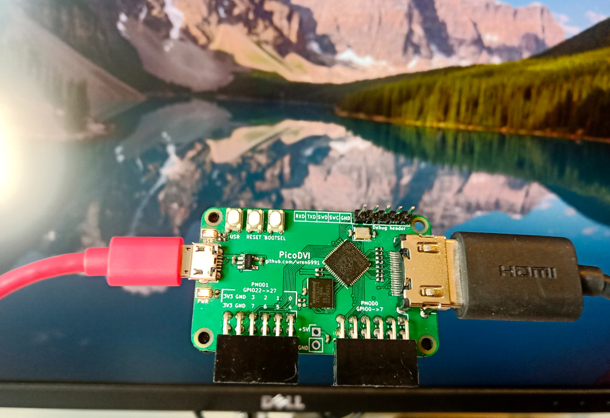

*640x480 RGB565 image, 640x480p 60 Hz DVI mode. 264 kB SRAM, 2x Cortex-M0+, system clock 252 MHz*

Quick links:

[Board Schematic](hardware/board/picodvi.pdf)

[Software Readme](software/)

About this Project
-----------------

This project stems from a stupid idea I had during RP2040 bringup. I couldn't convince myself the idea was too stupid to work, so I took a leap of faith on it, and the results are documented here.

RP2040 was designed to run at 133 MHz, but we found (without too much surprise) that typical silicon can be pushed further. In fact, there was overlap between the maximum system clock, and the TMDS bit clocks of slower DVI video modes. We had done great stuff with VGA on the FPGA platform, which ran at 48 MHz, but wouldn't it be absurd and wonderful to connect your microcontroller straight to an HD TV with no other electronics in between? This seemed unlikely to work out, but I stayed up at night playing around with assembly loops, and I could not convince myself that DVI was out of reach. Everything seemed to fit:

- With some of the core-local hardware on RP2040, and a neat encoding trick, I could do pixel-doubled TMDS encode on-the-fly using around 60% of an M0+ (running at 252 MHz, for 640x480p 60 Hz DVI)
- PIO can yeet out data streams at system clock frequency, and drive a 1/10th rate clock on the side, with pretty minimal programming
- Some of the DMA features are help with putting together the sync/blanking patterns on the fly, rather than having the patterns flat in memory
- With the second processor utterly unencumbered, you can render some pretty graphics to put on your DVI display. There is even enough RAM for a QVGA framebuffer!

The greatest unknown was driving 252 Mbps serial through the general-purpose digital pads (especially *differential* serial, emulated with two single-ended pads). By this point I was utterly driven and consumed by the need to find out if DVI could work, so I laid out a board over a few evenings after work.

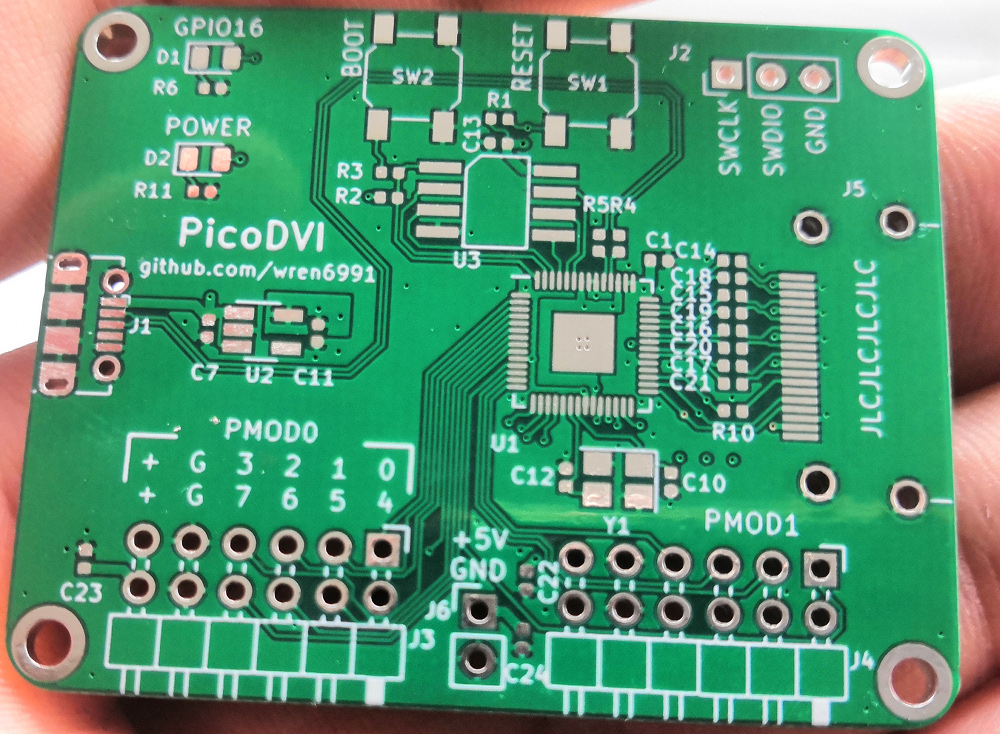

The Rev A board uses a slightly cursed coupling circuit I first saw (and used) on the ULX3S FPGA board, which just connects 3V3 IOs straight into the HDMI socket through some coupling caps.

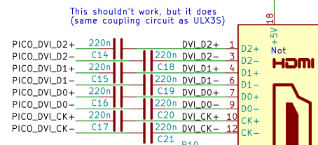

Those who understand the TMDS physical layer are probably screaming, but I was fine, because I did not read the electrical section of the spec until after I got this board working. Then I screamed. Before the boards arrived I did some debugging, with these two strategies:

- Run the entire system at 12 MHz (crystal freq), so that the signals are probeable, but the relative speed of IO, DMA and CPUs is the same. This makes sure my code can keep the PIO state machines fed with data
- Swap in an alternate PIO program which outputs 10 bit UART data frames instead of direct serial (a 17% drop in throughput). I could then dump the TMDS stream with a logic analyser, and examine and parse it on my machine

I also tried out my slightly harebrained TMDS encoding scheme, which matches the letter but not the spirit of the DVI specification, on an FPGA board with some DVI gateware I wrote for a previous weekend project. This confirmed that the principle was sound, and that my TV and monitor would have no trouble with the output of the matching software encoder on RP2040, provided the chip could physically shove bits out of the pins fast enough.

Because this is a home project, I didn't touch the HDL sim, and stuck to ARM debug, UART and logic analyser for my debugging. This worked some kinks out of the software, and bringup of the freshly-soldered board was smooth. After swapping the blue and red lanes into the right order -- to which I will say, in my defense, I _consistently_ thought the blue+sync lane was lane 2 -- I had a clean RGB565 QVGA 60 Hz static image on my monitor.

Improved Output Circuit
-----------------------

After reading the TMDS electrical section of the DVI spec, and staring quietly out the window for a while, wondering how this board *ever* worked, I rethought the output circuit. Eight capacitors was clearly not the way to go -- what I really needed was eight *resistors*. That's what I call a DVI PHY.

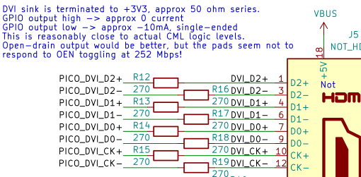

I also revised my earlier approach of "turn all the GPIOs up to 11", and reduced the pad drive and slew. At work on Monday, a colleague agreed it would be a great idea to plug my microcontroller monstrosity into the scope setup we use for 4k HDMI testing. Here are the results at VGA 60 Hz (252 Mbps):

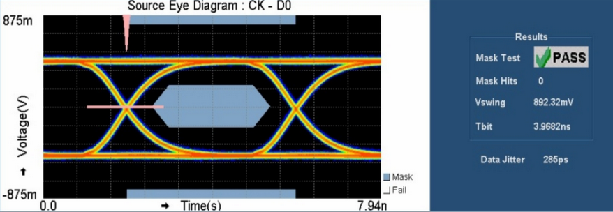

I was sitting on the other side of the lab while he was running the test, and when the eye mask appeared he just said "do you wanna see something funny".


A clean bill of health! We also tried 720p30 (372 Mbps), which requires overvoltage on typical silicon (something you can do with one register write on RP2040):

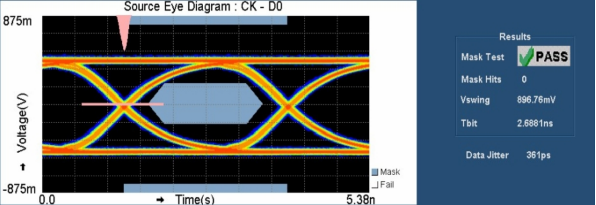

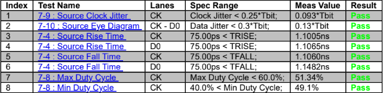

Honestly, this has shaken me. This is a silly amount of bandwidth for a tiny little microcontroller.

Although it passes the eye mask and a few other tests, this circuit is not fully compliant with the DVI spec. In particular, our logic `1` is not quite right, due to the CMOS drive on the GPIOs: any more than a \~60 mV mismatch between the Source and Sink +3V3 rails will push our high-level offset outside of the +- 10 mV allowed by the spec. This is a real nitpick, because a *differential* receiver is unlikely to care about a 10 mV *commmon mode* offset, but still -- it is out of spec. A better circuit could use a fast Si diode and a smaller resistor value, e.g. 220 ohm, so that the emulated CML output floats on the sink's +3V3 supply when we output our 3V3 CMOS high level, but still sinks the requisite 10 mA when driving low.

That said, it's compliant enough that I can wander around the office and plug it into every monitor I see, and not even _one_ of them explodes (if my manager is reading this -- hi).

Going Further
-------------

Everything we have done is software defined -- there's no video hardware on this chip. That would of course be _silly_ on a microcontroller. Let's list all the hardware resources used to display a pixel-doubled image on screen:

- 3 out of 8 PIO state machines (the DVI code requires these all be on the same PIO instance, of which there are two, with four state machines each)
- 6 out of 12 DMA channels (two per TMDS lane: one for control blocks, one for data)
- 30% of DMA bandwidth and PIO bus endpoint bandwidth
- 60% of CPU cycles on one core, other core 100% free
- Just over 50% of RAM with a QVGA RGB565 image (but RGB332 support is simple enough)
- The PicoDVI board's only HDMI-shaped socket

Hmm. All of these numbers are less than half of the total, and everything else is software. It's a shame there's only one socket I can put an HDMI cable in. I mean, I guess I _do_ have these adorable PMOD-DVI adapters that I keep plugging into FPGA boards and getting away with it:

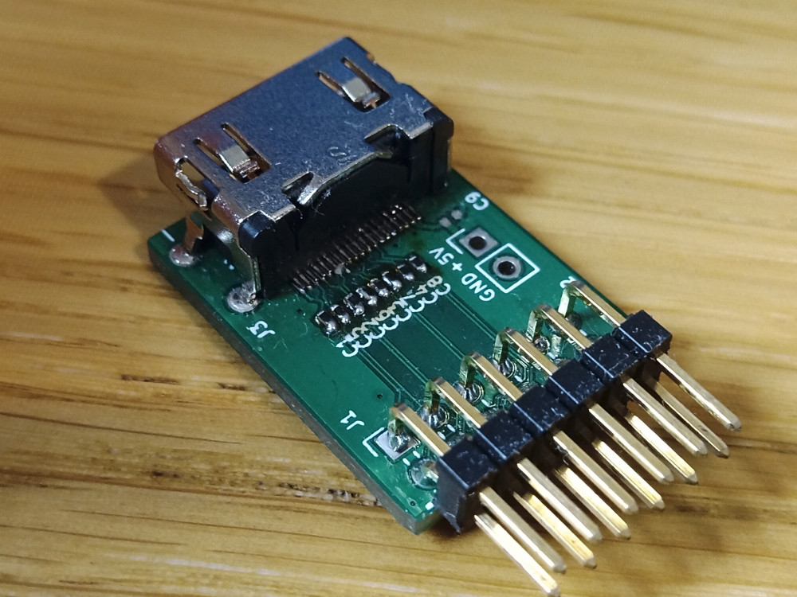

Oh. Maybe? It fits...

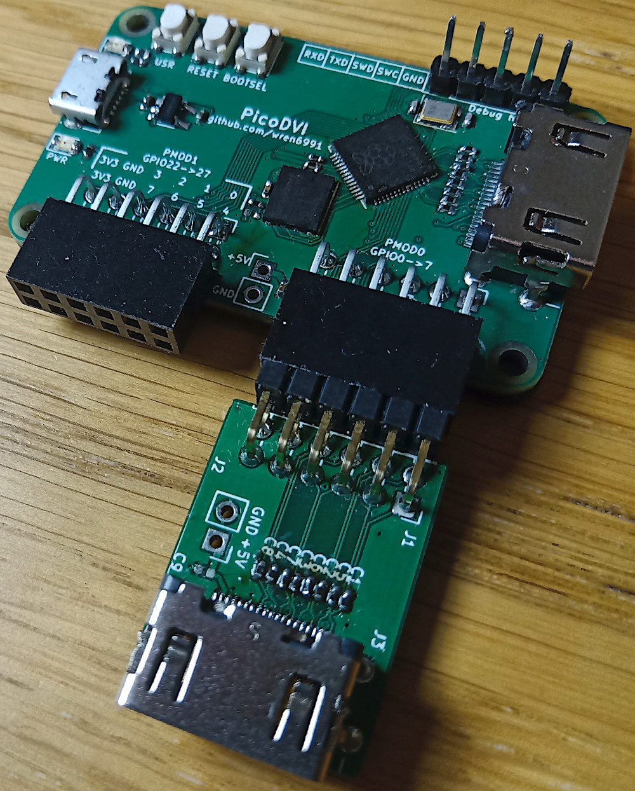

I guess the jig is up at this point, because of course I wouldn't post something so daft-looking if it didn't work:

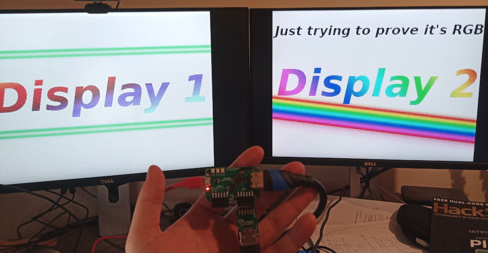


[The code is here.](software/apps/dual_display/main.c)


Example Apps
------------

The [software readme](software/) has some example apps which put the DVI library through its paces, with pictures for some of the fun ones. I won't duplicate that content here.


Encoding TMDS
-------------

DVI uses an encoding scheme called TMDS during the video periods. 8 data bits are represented by a 10 bit TMDS symbol, which is serialised at 10x the pixel clock. 3 lanes transfer 24 bits of data per pixel clock, which for our purposes is one pixel. TMDS is DC-balanced, although DVI as a whole is *not* DC-balanced on all lanes, due to the control symbol encoding. The algorithm given in the DVI spec is quite fussy, and you are supposed to match its output exactly. It tracks running disparity with a counter, and optionally inverts symbols to bound the disparity, with some tie-break rules for 0-balance symbols.

Key fact about TMDS: if the current running disparity is 0, and you encode data `x` followed by data `x ^ 0x01`, this produces a pair of TMDS symbols with 0 net parity. If you manipulate the input data in this way -- duplicating the pixels, and twiddling the LSB -- TMDS becomes *stateless*, because the running disparity is defined to be 0 at the start of each video period, and returns to 0 after each duplicated pixel pair.

If we have a half-resolution scanline buffer, and are only interested in 7 or fewer bits of significance for each colour channel, we can encode this with a lookup table, where each entry is two TMDS symbols with net balance 0. The toggling of the LSB with each output pixel is not noticeable.

Great. LUTs are fast. On a Cortex-M0+, though, they are not *that* fast. Each load/store is 2 cycles, and we end up spending a surprising amount of time shifting and masking the data. Here is a vaguely plausible loop for encoding one colour channel, compiled with `-O3 -mcpu=cortex-m0plus` on gcc 9 ([Godbolt link](https://godbolt.org/z/q741oK)).


*C*

```
void tmds_encode_16bpp(const uint16_t *pixbuf, uint32_t *tmdsbuf, size_t n_pix, uint16_t chan_mask, unsigned int chan_shift) {
    for (size_t i = 0; i < n_pix; ++i) {
        unsigned int idx = (pixbuf[i] >> chan_shift) & chan_mask;
        tmdsbuf[2 * i] = tmds_table[idx];
        tmdsbuf[2 * i + 1] = tmds_table[idx + 1];
    }
}
```

*ARMv6M*

```
tmds_encode_16bpp(unsigned short const*, unsigned long*, unsigned int, unsigned short, unsigned int):
        push    {r4, r5, r6, r7, lr}
        ldr     r7, [sp, #20]
        cmp     r2, #0
        beq     .L1
        lsls    r2, r2, #3
        ldr     r5, .L6
        adds    r2, r1, r2

.L4:
        ldrh    r4, [r0]     ; 2 cyc
        adds    r0, r0, #2   ; 1 cyc
        asrs    r4, r4, r7   ; 1 cyc
        ands    r4, r3       ; 1 cyc

        lsls    r6, r4, #2   ; 1 cyc
        ldr     r6, [r5, r6] ; 2 cyc
        adds    r4, r4, #1   ; 1 cyc
        str     r6, [r1]     ; 2 cyc

        lsls    r4, r4, #2   ; 1 cyc
        ldr     r4, [r5, r4] ; 2 cyc
        str     r4, [r1, #4] ; 2 cyc

        adds    r1, r1, #8   ; 1 cyc
        cmp     r2, r1       ; 1 cyc
        bne     .L4          ; 2 cyc if taken
.L1:
        pop     {r4, r5, r6, r7, pc}
```

Focusing on the loop starting at `.L4`, this is a surprisingly literal translation -- first load a pixel, bump the pointer, mask and shift (5 cycles). Next transfer a pixel from the LUT to the output buffer (5 cycles) while bumping the LUT index (1 cycle), transfer the second pixel (5 cycles), do a little bookkeeping and branch back to the start (4 cycles). Each loop takes 20 cycles, and encodes one colour channel of 2 output pixels.

We must output a pixel once per 10 system clock cycles (as the system runs at the TMDS bit clock), and since we are doubling pixels horizontally we may as well double vertically too, by using each encoded buffer twice. Taking horizontal blanking into account (1:4 ratio at VGA), we would spend 1.2 of our two cores on TMDS encode, and have 0.8 cores left to generate DVI timing and render graphics.

The compiler has messed up here (or perhaps I have unwittingly constrained it to produce bad code by writing shoddy C), and we can save 4 cycles right off the bat with better instruction selection:

```
.L4:
        ldrh    r4, [r0]     ; 2 cyc
        adds    r0, r0, #2   ; 1 cyc
        asrs    r4, r4, r7   ; 1 cyc
        ands    r4, r3       ; 1 cyc

        lsls    r4, r4, #2   ; 1 cyc
        ldr     r6, [r5, r4] ; 2 cyc
        stmia   r1!, {r6}    ; 2 cyc

        adds    r4, r4, #4   ; 1 cyc
        ldr     r6, [r5, r4] ; 2 cyc
        stmia   r1!, {r6}    ; 2 cyc

        cmp     r2, r1       ; 1 cyc
        bne     .L4          ; 2 cyc if taken
```

But this is still painfully slow -- it wouldn't even fit on one core. Some avenues for improvement:

- Use a word load to fetch two input pixels at once, so we can amortise the load cost, and some of the shift/mask cost
- Use larger `ldmia` and `stmia` on the LUT to squeeze more memory bandwidth out of the M0+ (`ldr` is 2 cycles and `ldmia` is n + 1)
- Use the interpolators on RP2040 to accelerate address generation

The interpolator is a fun piece of hardware for accelerating fixed point arithmetic. Note: "interpolator" is a working title which we will definitely not forget to change to something better before launch. The _original_ plan was a simple configurable 2D phase accumulator that we could use to play Super Mario Kart on the FPGA platform at 48 MHz. Sadly, that game port never materialised, not least because we couldn't publish it. After a lot of back and forth between hardware and software, we realised that making the datapath a little more flexible would go a long way, and this eventually let to the current guise of the interpolator:

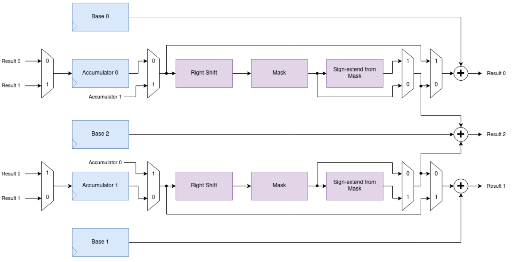

Our trick here is loading a one-word pixel pair into one of the accumulators, and configuring the interpolator to extract the correct bits of each pixel, shift them, and add them to a LUT base pointer. The interpolator doesn't have a left shift (not needed for Super Mario Kart) so for the blue channel (least significant in our RGB565 pixel format) we need to do one left shift per two pixels on the processor, to scale up to the LUT entry size. For the other channels we can use a different loop, without the left shift. Here is the encode loop from `tmds_encode.S`:

```
// r0: Input buffer (word-aligned)
// r1: Output buffer (word-aligned)
// r2: Input size (pixels)
// r3: Left shift amount

decl_func tmds_encode_loop_16bpp_leftshift
	push {r4, r5, r6, r7, lr}
	lsls r2, #3
	add r2, r1
	mov ip, r2
	ldr r2, =(SIO_BASE + SIO_INTERP0_ACCUM0_OFFSET)
	b 2f
.align 2
1:
.rept TMDS_ENCODE_UNROLL
	ldmia r0!, {r4}             ; 2 cyc
	lsls r4, r3                 ; 1 cyc
	str r4, [r2, #ACCUM0_OFFS]  ; 1 cyc
	ldr r4, [r2, #PEEK0_OFFS]   ; 1 cyc
	ldmia r4, {r4, r5}          ; 3 cyc
	ldr r6, [r2, #PEEK1_OFFS]   ; 1 cyc
	ldmia r6, {r6, r7}          ; 3 cyc
	stmia r1!, {r4, r5, r6, r7} ; 5 cyc
.endr
2:
	cmp r1, ip                  ; 1 cyc
	bne 1b                      ; 2 cyc if taken
	pop {r4, r5, r6, r7, pc}
```

Assuming `TMDS_ENCODE_UNROLL=1`, each loop iteration takes 20 cycles, and produces 4 output pixels. Taking the lack of left shift for red and green into account, this works out to 58% of a core to do TMDS encode, which is just over 2x faster than the compiled LUT loop. We can get another 10 or 15% performance by increasing `TMDS_ENCODE_UNROLL`.

We handle 8bpp pixels in a similar way, but use both interpolators -- one to extract pixels 0 and 1 from the loaded word, and one for pixels 2 and 3. 8bpp encode is slightly faster than 16bpp encode, because we get four pixels for each load from the pixel buffer.

It is just barely possible to do full resolution encode, which is what is shown off in the first image at the top of this Readme. The code is awful, go check it out if you hate yourself.
