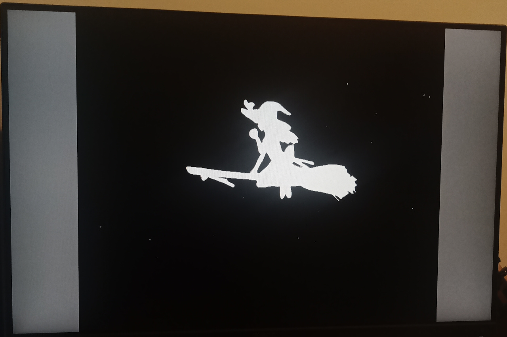
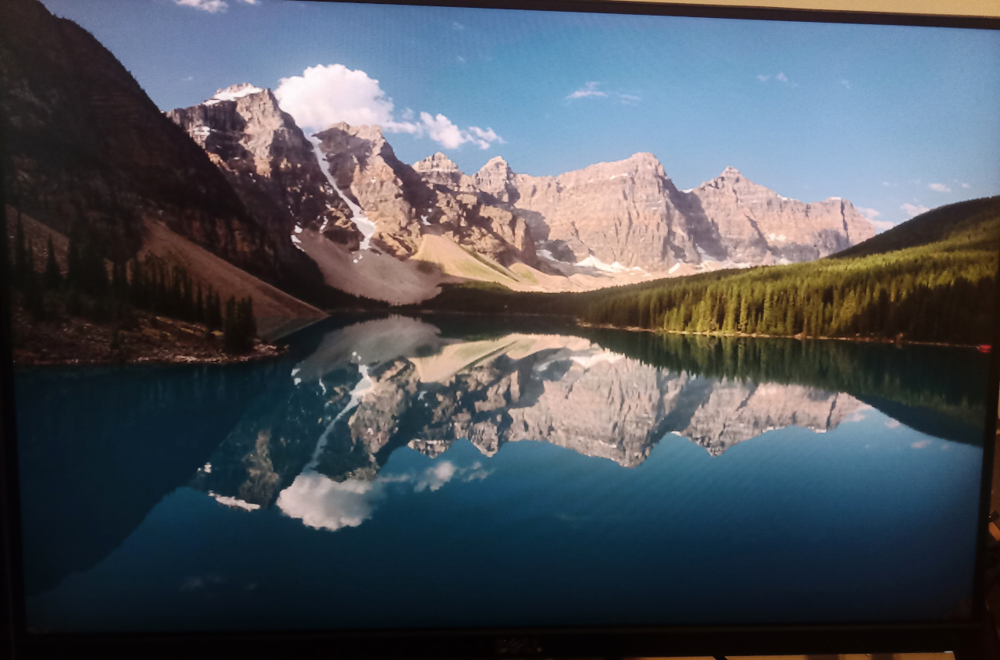
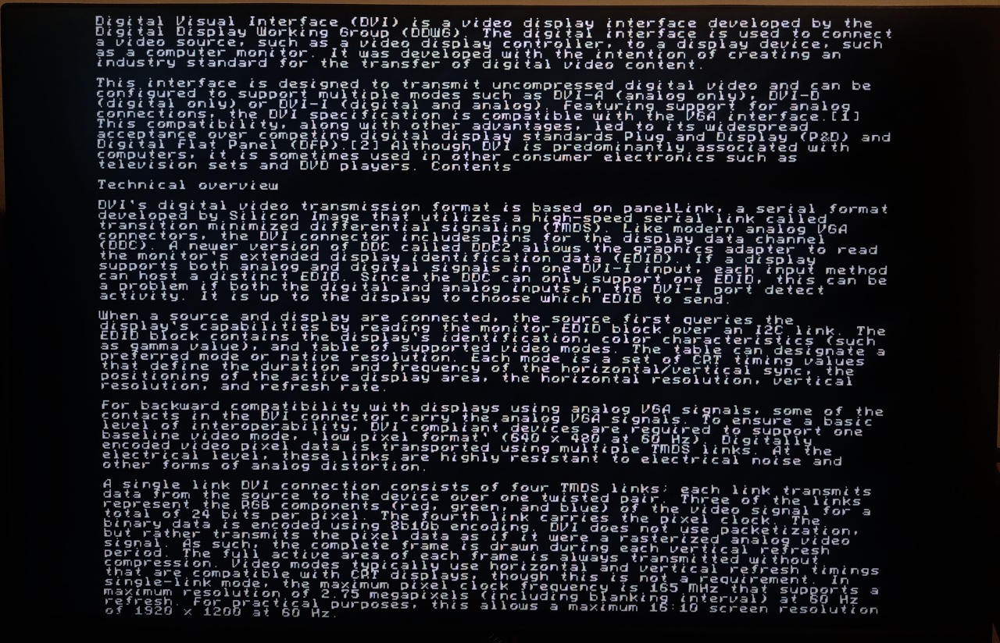
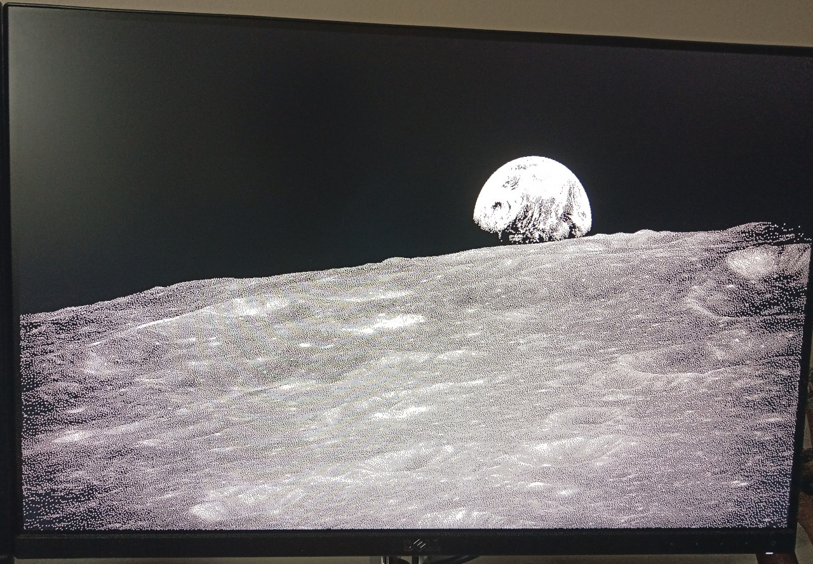

Building
--------

You need to have the Pico SDK installed, as well as a recent CMake and arm-none-eabi-gcc.


```bash
mkdir build
cd build
PICO_SDK_PATH=path/to/sdk cmake -DPICO_COPY_TO_RAM=1 ..
make -j$(nproc)
```

This will build all the example apps. You can then do e.g.

```bash
cp apps/sprite_bounce/sprite_bounce.uf2 /media/${USER}/RPI-RP2/
```

To flash a DVI board plugged into your system. Note the `PICO_COPY_TO_RAM=1` is important -- some of the apps will not run if this is not passed, because they use the SSI in fast DMA streaming mode. Others might underperform if they have large image assets (larger than the XIP cache) in flash.

Support for Different Boards
----------------------------

The DVI code is configured with which pins and which PIO state machines to use for signal generation, defined by a `dvi_serialiser_cfg` struct which looks like this:

```
static const struct dvi_serialiser_cfg picodvi_dvi_cfg = {
	.pio = pio0,
	.sm_tmds = {0, 1, 2},
	.pins_tmds = {10, 12, 14},
	.pins_clk = 8,
	.invert_diffpairs = true
};
```

Serial configurations for a handful of boards are listed in [common_dvi_pin_configs.h](include/common_dvi_pin_configs.h). Feel free to raise a PR to add your board to this file. All of the example apps use the `DVI_DEFAULT_SERIAL_CONFIG` from this header to select their pin configuration, which has a default value of `pico_sock_cfg`. You can pass `-DDVI_DEFAULT_SERIAL_CONFIG=some_other_board` to `cmake` to override this default, so that the example apps will be built with a different serial configuration.

As well as the DVI serial configuration, you may also want to set the `PICO_BOARD` flag for your target board to pick up things like UART and LED pin settings.

Example Apps
------------

### Bad Apple



Plays the Touhou music video at 720p 30FPS (no sound). Because the video is largely black and white silhouettes, it's highly compressible, and there is a shortcut for encoding full-res TMDS scanlines with a 2-colour palette ([check the source](apps/bad_apple/rle_decompress.S)). Currently around 1 minute of video fits in 16 MiB of flash, with per-scanline RLE compression. Eventually I'd like to fit the whole video.

### Vista



Full-resolution VGA RGB565 image viewer. As each raw image is over 600 kB, only a small slice of the image can reside in memory at once, so images are streamed continuously from flash at 40 MB/s. The TMDS encode uses around 95% of both cores, which is why we need a raw image format. The remaining 5% of core 1 handles the horizontal DMA interrupts to keep the DVI signalling going, and core 0 handles the streaming of the image from flash. This is not very practical, but it was a fun project.

*NOTE: you must first copy the [image data UF2](assets/vista_data.uf2) before running this app*

If you define the symbol `TMDS_FULLRES_NO_DC_BALANCE` then you can remove the DC balance feedback from the TMDS encode, which *may* give you enough time to do something more interesting with full-resolution RGB graphics, provided your DVI signals are DC-coupled, and your TV is feeling lenient. This is absolutely forbidden by the standard, but don't worry, I won't tell anyone if you do this.

### Terminal



Display text with an 8x8px black and white font, displayed at full resolution (so 80x60 characters at 640x480p 60 Hz, or 160x90 characters at 720p30). This originally worked by storing the font as a set of canned pre-balanced TMDS sequences, but this had a significant memory footprint. There is now fast generic full-res encode ([code here](https://github.com/Wren6991/PicoDVI/blob/6bafa3c3e3f6796b49eb599476ee2a43ae5ccf67/software/libdvi/tmds_encode.S#L176)) which again subverts the intent of the DVI specification to cheat and still get compliant output, so you can display text over DVI with about 30% of a core.

### Moon



Use the full-res 1bpp encode to display a dithered black/white image of the Earthrise from Apollo 8. The same encoded buffer is sent out on all 3 lanes during the horizontal active period, but the encode is fast enough that you can do bitplaned RGB111 if you like. There's a 640x480 and a 1280x720 version.

Two variants of this app are built: `moon.uf2` and `moon_pio_encode.uf2`. All the other examples use software TMDS encode, but the second variant uses [this PIO program](https://github.com/Wren6991/PicoDVI/blob/master/software/libdvi/tmds_encode_1bpp.pio) to offload the encode to a fourth state machine, which is then bounced through memory via DMA to the three serialiser state machines.

### Hello DVI

Minimal DVI example. Displays a scrolling QVGA RGB565 test card with a 640x480p 60Hz DVI mode.

### Mandelbrot

Render a Mandelbrot set to a QVGA RGB565 framebuffer.

### Sprite Bounce

A bunch of images bouncing around on the screen, using my sprite library written for ARMv6M. This uses pixel-doubled RGB graphics, with DVI modes ranging from 640x480p 60Hz to 1280x720p 30Hz. Core 0 renders the graphics, one scanline at a time, and passes scanlines to core 1 for encoding and shipping out to the display.

